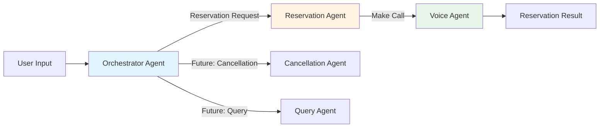

# AI Concierge Agent Architecture

This document describes the agent architecture for the AI Concierge restaurant reservation system, built with the [OpenAI Agents SDK](https://github.com/openai/openai-agents-python).

## Overview

The AI Concierge uses a **3-tier multi-agent architecture** with handoffs to handle restaurant reservations end-to-end:

```
User Input → Orchestrator → Reservation Agent → Voice Agent → Reservation Result
```

This architecture allows for:
- **Extensibility**: Easy to add new capabilities (cancellations, queries, etc.)
- **Separation of concerns**: Each agent has a specific responsibility
- **Intelligent routing**: Orchestrator routes to the appropriate specialized agent

## Agents

### 1. Orchestrator Agent (Tier 1)

**Role**: Request router and intent analyzer

**Responsibilities**:
- Analyze user requests to determine intent
- Route to appropriate specialized agent based on request type
- Handle unsupported request types gracefully

**Current Routing Logic**:
- Reservation requests → Reservation Agent
- Future: Cancellation requests → Cancellation Agent
- Future: Query requests → Query Agent
- Future: Modification requests → Modification Agent

**Handoffs**:
- `Reservation Agent`: For booking/making reservations
- Future: Additional specialized agents

**Output Type**: Delegated to specialized agents

### 2. Reservation Agent (Tier 2)

**Role**: Reservation workflow manager

**Responsibilities**:
- Parse and validate reservation details from user input
- Extract structured information (restaurant, party size, date, time, etc.)
- Look up restaurant information using tools
- Validate constraints (party size 1-50, all required fields present)
- Hand off to Voice Agent for call execution

**Tools**:
- `find_restaurant`: Look up restaurant by name

**Handoffs**:
- `Voice Agent`: For making the actual reservation call

**Output Type**: `ReservationDetails` (structured Pydantic model)

### 3. Voice Agent (Tier 3)

**Role**: Voice conversation executor

**Responsibilities**:
- Initiate outbound calls to restaurants via Twilio
- Conduct natural voice conversations
- Provide all reservation details to restaurant
- Obtain confirmation numbers
- Handle edge cases (voicemail, unavailable times)
- Return structured results

**Tools**:
- `make_call`: Initiate a phone call
- `get_call_status`: Check call status
- `end_call`: End active calls

**Output Type**: `ReservationResult` (structured Pydantic model)

## Agent Handoff Flow



## Function Tools

All tools are decorated with `@function_tool` from the Agents SDK:

### Restaurant Tools

```python
@function_tool
def find_restaurant(restaurant_name: str) -> dict:
    """Find a restaurant by name."""
```

### Twilio/Voice Tools

```python
@function_tool
def make_call(
    phone_number: str,
    restaurant_name: str,
    party_size: int,
    date: str,
    time: str,
    customer_name: str | None = None,
    special_requests: str | None = None,
) -> dict:
    """Initiate a phone call to make a reservation."""

@function_tool
def get_call_status(call_sid: str) -> dict:
    """Get the status of an ongoing call."""

@function_tool
def end_call(call_sid: str) -> dict:
    """End an active call."""
```

## Guardrails

The system uses the SDK's built-in guardrail system for input and output validation:

### Input Guardrails

1. **Input Validation Guardrail**
   - Checks for empty input
   - Validates input length (max 1000 chars)
   - Blocks suspicious patterns (XSS, injection attempts)

2. **Party Size Guardrail**
   - Ensures party size is between 1-50 people
   - Validates numbers in user input

### Output Guardrails

1. **Output Validation Guardrail**
   - Detects sensitive information in output
   - Blocks outputs containing API keys, passwords, SSNs, credit cards

2. **Output Sanitization Guardrail**
   - Masks potential API keys and tokens
   - Redacts long alphanumeric sequences

## Agent Loop

The SDK's Runner executes the agent loop:

```python
result = Runner.run_sync(
    agent=orchestrator,
    input=user_input,
)
```

**Loop flow**:
1. Orchestrator receives user input
2. Guardrails validate input
3. Orchestrator analyzes intent (e.g., "reservation request")
4. Orchestrator hands off to Reservation Agent
5. Reservation Agent extracts reservation details using LLM
6. Reservation Agent uses `find_restaurant` tool to get restaurant info
7. Reservation Agent hands off to Voice Agent
8. Voice Agent uses `make_call` tool
9. Voice Agent returns structured `ReservationResult`
10. Guardrails validate output
11. Final output returned to user

## Example Flow

```python
# User: "Book a table at Demo Restaurant for 4 people tomorrow at 7pm"

# 1. Orchestrator analyzes: "This is a reservation request"
# 2. Orchestrator hands off to Reservation Agent
# 3. Reservation Agent extracts:
ReservationDetails(
    restaurant_name="Demo Restaurant",
    party_size=4,
    date="tomorrow",
    time="7pm",
    user_name=None,
    user_phone=None,
    special_requests=None
)

# 4. Reservation Agent uses find_restaurant tool
# 5. Reservation Agent hands off to Voice Agent
# 6. Voice Agent calls make_call tool
# 7. Voice Agent returns:
ReservationResult(
    status="confirmed",
    restaurant_name="Demo Restaurant",
    confirmation_number="DEMO-12345",
    message="Reservation confirmed...",
    call_duration=45.0
)

# 8. Result returned through the chain to user
```

## Future Extensibility

The orchestrator pattern makes it easy to add new capabilities:

### Cancellation Agent
```python
cancellation_agent = Agent(
    name="Cancellation Agent",
    instructions="Handle reservation cancellations...",
    tools=[find_reservation, cancel_reservation],
)

orchestrator = create_orchestrator_agent(
    reservation_agent,
    cancellation_agent,  # New!
)
```

### Query Agent
```python
query_agent = Agent(
    name="Query Agent",
    instructions="Answer questions about reservations...",
    tools=[find_reservation, get_restaurant_info],
)

orchestrator = create_orchestrator_agent(
    reservation_agent,
    cancellation_agent,
    query_agent,  # New!
)
```

## Key Benefits of This Architecture

1. **Modularity**: Each agent has a single, well-defined responsibility
2. **Extensibility**: Easy to add new capabilities without modifying existing agents
3. **Maintainability**: Clear separation of concerns
4. **Testability**: Each agent can be tested independently
5. **Scalability**: Agents can be optimized or replaced individually
6. **Intelligent Routing**: Orchestrator provides smart request routing

## Key Benefits of Using Agents SDK

1. **Structured Outputs**: Automatic validation with Pydantic models
2. **Agent Handoffs**: Clean delegation between specialized agents
3. **Function Tools**: Type-safe tool definitions with automatic schema generation
4. **Built-in Guardrails**: Extensible input/output validation framework
5. **Tracing**: Automatic tracing for debugging and monitoring
6. **Provider Agnostic**: Works with OpenAI and 100+ other LLMs via LiteLLM

## Configuration

Agents are configured in `concierge/config.py`:

```python
agent_model: str = "gpt-4o"
agent_temperature: float = 0.7
```

## Testing

Tests verify the full agent chain:

```python
def test_agent_handoff_chain():
    voice_agent = create_voice_agent(...)
    reservation_agent = create_reservation_agent(voice_agent, find_restaurant)
    orchestrator = create_orchestrator_agent(reservation_agent)
    
    # Verify the handoff chain
    assert reservation_agent in orchestrator.handoffs
    assert voice_agent in reservation_agent.handoffs
```

## References

- [OpenAI Agents SDK](https://github.com/openai/openai-agents-python)
- [Documentation](https://openai.github.io/openai-agents-python/)
- [Handoffs Example](https://github.com/openai/openai-agents-python/blob/main/examples/handoffs/message_filter.py)
- [Guardrails Documentation](https://openai.github.io/openai-agents-python/guardrails/)
