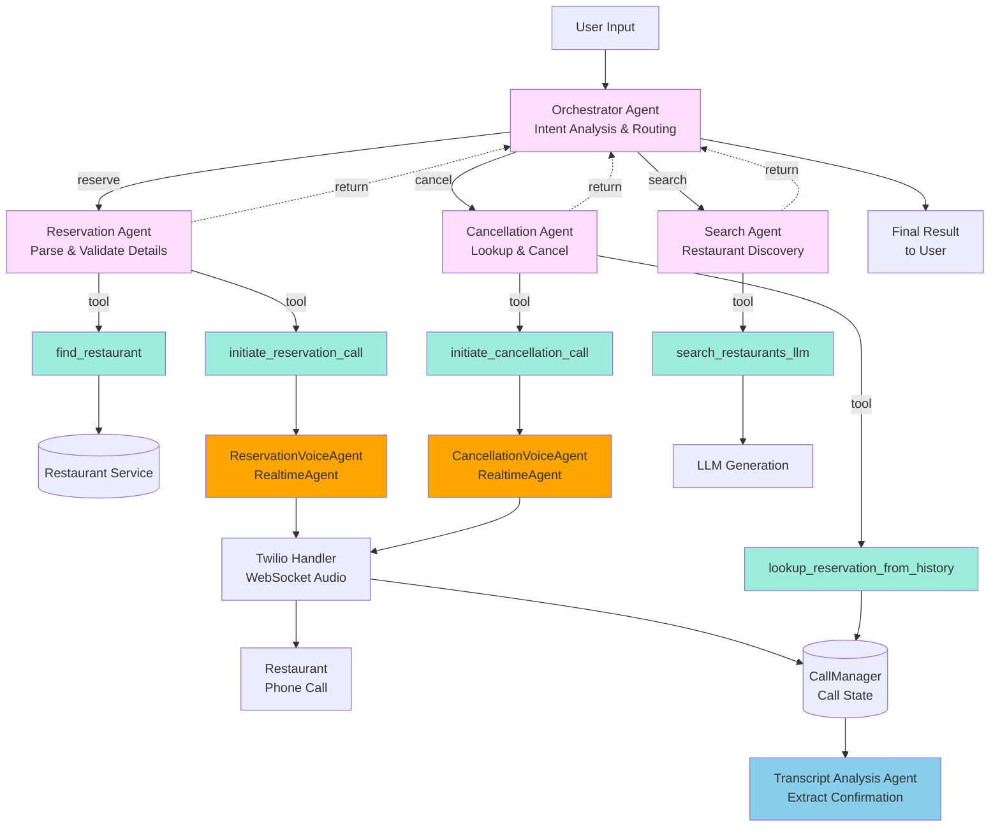
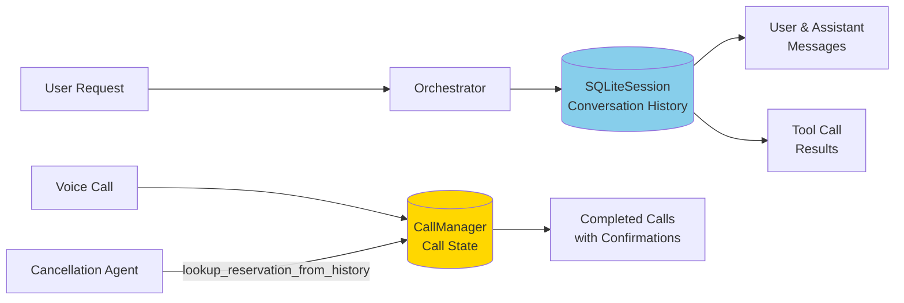
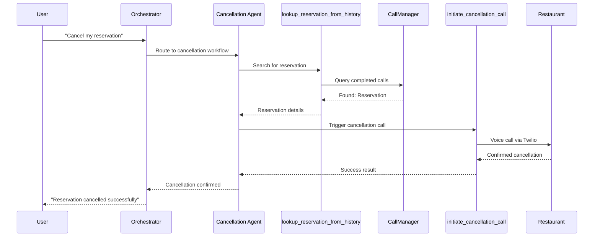
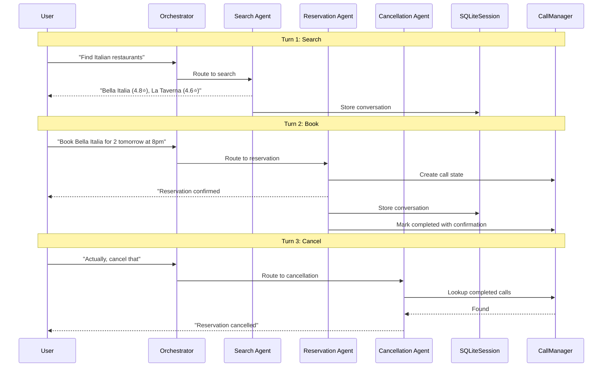

# Agent Flow Architecture

This document visualizes the multi-agent architecture and routing flow of the AI Concierge system.

## Agent Hierarchy and Routing

## Agent Details

### Orchestrator Agent (Tier 1)
- **Role**: Central router and intent analyzer
- **Responsibilities**:
  - Analyze user intent from natural language
  - Route to appropriate specialized agent
  - Manage agent handoffs
  - Apply input/output guardrails

- **Handoffs**:
  - Reservation Agent
  - Cancellation Agent
  - Search Agent

### Reservation Agent (Tier 2)
- **Role**: Booking workflow manager
- **Tools**:
  - `find_restaurant`: Look up restaurant information
  - `initiate_reservation_call`: Trigger voice call to make reservation
- **Output**: Structured reservation confirmation

### Cancellation Agent (Tier 2)
- **Role**: Cancellation workflow manager
- **Tools**:
  - `lookup_reservation_from_history`: Search CallManager for completed reservation calls
  - `initiate_cancellation_call`: Trigger voice call to cancel reservation
- **Key Feature**: Uses CallManager to find reservations from completed calls (not session history)

### Search Agent (Tier 2)
- **Role**: Restaurant discovery
- **Tools**:
  - `search_restaurants_llm`: Generate restaurant recommendations using LLM
- **Output**: List of recommended restaurants with ratings

### ReservationVoiceAgent (RealtimeAgent)
- **Role**: Conduct real-time voice conversation for making reservations
- **Type**: `RealtimeAgent` (OpenAI Realtime API)
- **Created by**: `initiate_reservation_call` tool
- **Responsibilities**:
  - Natural voice conversation with restaurant staff
  - Request reservation with details (date, time, party size, name)
  - Handle dynamic responses and interruptions
  - Obtain confirmation number
- **Integration**: Twilio Media Streams for bidirectional audio

### CancellationVoiceAgent (RealtimeAgent)
- **Role**: Conduct real-time voice conversation for cancelling reservations
- **Type**: `RealtimeAgent` (OpenAI Realtime API)
- **Created by**: `initiate_cancellation_call` tool
- **Responsibilities**:
  - Natural voice conversation with restaurant staff
  - Cancel reservation using confirmation number or details
  - Handle dynamic responses and interruptions
  - Confirm cancellation
- **Integration**: Twilio Media Streams for bidirectional audio

### Transcript Analysis Agent
- **Role**: Analyze call transcripts to extract confirmed details
- **Used by**: CallManager after voice calls complete
- **Responsibilities**:
  - Extract confirmation numbers from transcripts
  - Identify confirmed date/time if different from requested
  - Update CallManager with accurate reservation details
- **Key Feature**: Uses LLM to understand natural conversation context

## Guardrails

The Orchestrator applies guardrails at both input and output stages:

### Input Guardrails
1. **Input Validation**: Empty input, length limits (max 1000 chars), suspicious patterns
2. **Party Size**: Validates party size between 1-12 people

### Output Guardrails
1. **Output Validation**: Detects sensitive information (API keys, SSN, credit cards)
2. **Output Sanitization**: Masks potential sensitive data

## Session Memory and Call Tracking

**Two separate storage mechanisms:**

1. **SQLiteSession**: Stores conversation history (messages, tool results) for context-aware responses
2. **CallManager**: Stores completed call states with confirmation numbers for reservation lookup

The cancellation agent uses `CallManager` to find reservations, not session history. However, session history enables the agent to understand context like "cancel my reservation" without explicit details.

## Example Flow: "Cancel my reservation"

## Multi-Turn Conversation Example

## Key Features

1. **Intelligent Routing**: Orchestrator analyzes intent and routes to the right agent
2. **Session Memory**: SQLiteSession stores conversation history for context-aware responses
3. **Call Tracking**: CallManager stores completed call states with confirmation numbers for reservation lookup
4. **Tool Composition**: Each agent has specific tools for its domain
5. **Agent Handoffs**: Clean delegation between specialized agents
6. **Guardrails**: Built-in validation and rate limiting
7. **Real-time Voice**: Direct integration with Twilio for actual phone calls

