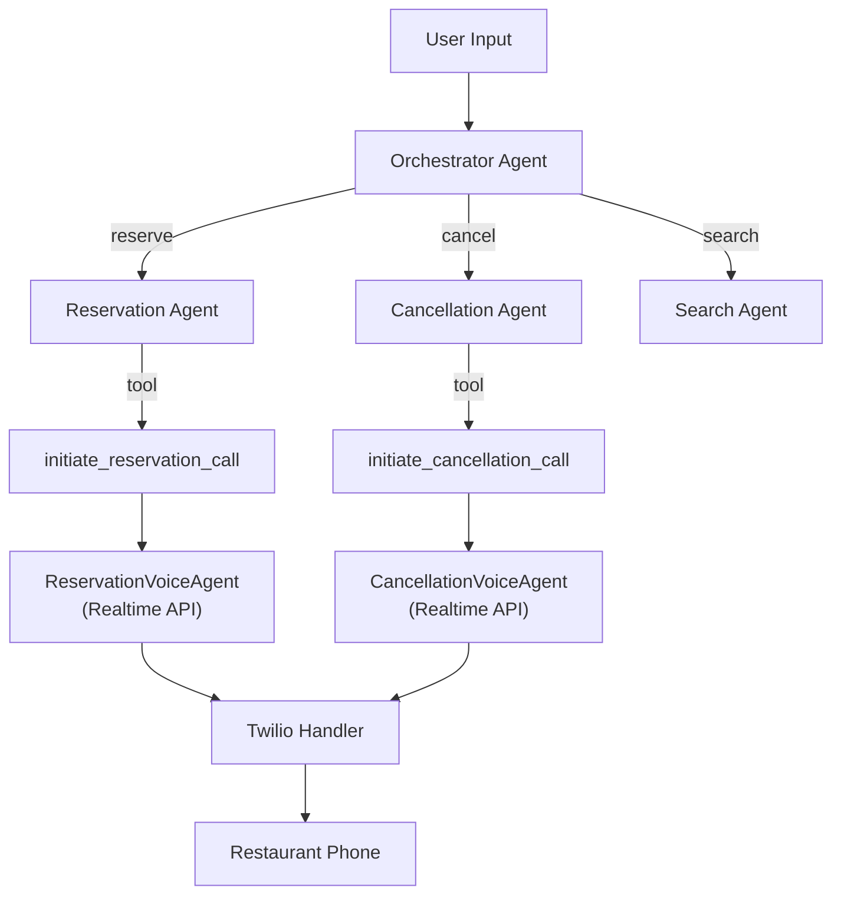
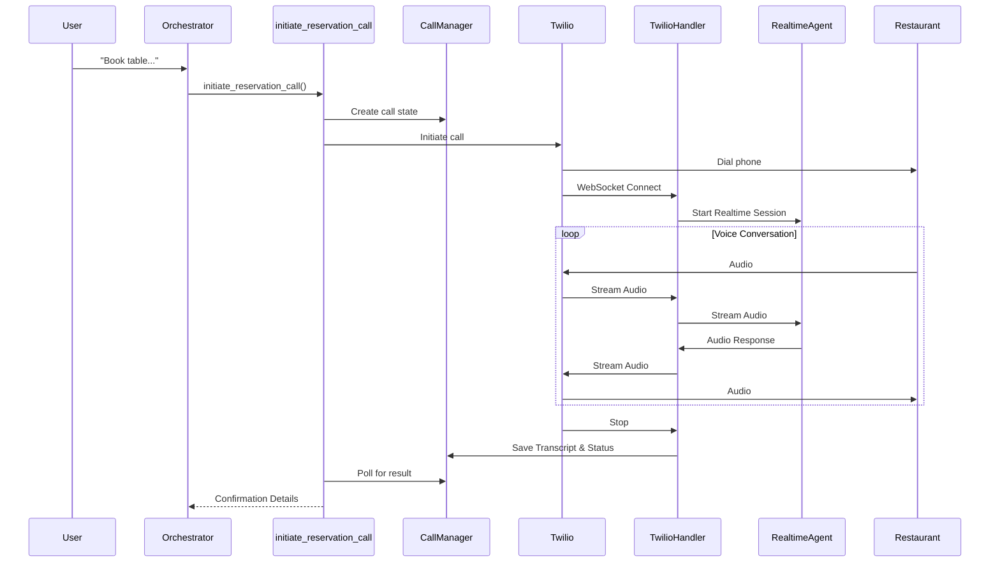
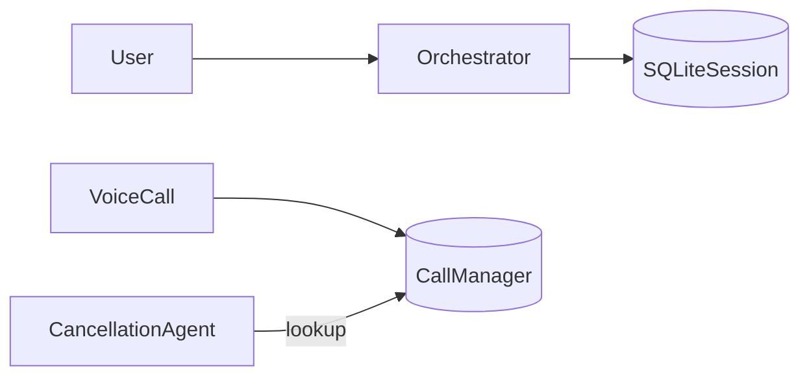

# System Architecture

## Agent Hierarchy

The system uses a 2-tier agent architecture with a central orchestrator.

## Agent Details

### 1. Orchestrator Agent (Tier 1)
Routes requests based on intent:
- "book" → Reservation Agent
- "cancel" → Cancellation Agent
- "find" → Search Agent

### 2. Reservation Agent (Tier 2)
- Parses reservation details.
- Uses `find_restaurant` tool.
- Triggers voice call via `initiate_reservation_call`.

### 3. Cancellation Agent (Tier 2)
- Parses cancellation requests.
- Uses `lookup_reservation_from_history` to find reservations in session memory.
- Triggers cancellation call via `initiate_cancellation_call`.

### 4. Search Agent (Tier 2)
- Parses search queries.
- Uses `search_restaurants_llm` to generate realistic options.

### 5. Realtime Voice Agent
- Conducts natural voice conversations using OpenAI Realtime API.
- Connects via Twilio Media Streams.

## Voice Call Flow

Real-time voice calls are handled via Twilio Media Streams and OpenAI Realtime API.

## Session Memory

The system uses two separate storage mechanisms:

1. **SQLiteSession**: Stores conversation history (messages, tool results) for context-aware responses.
2. **CallManager**: Stores completed call states with confirmation numbers for reservation lookup.

## Guardrails
- **Input**: Rate limiting, validation, party size checks.
- **Output**: Sanitization (PII redaction), validation.

## Configuration
Agents are configured in `concierge/config.py`.
