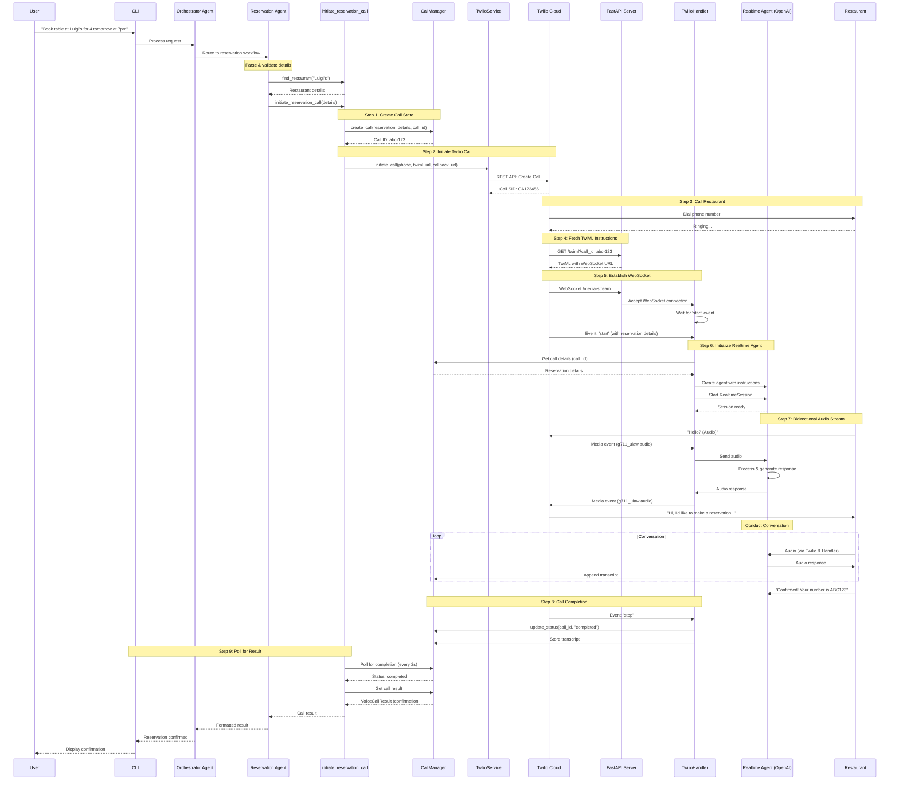
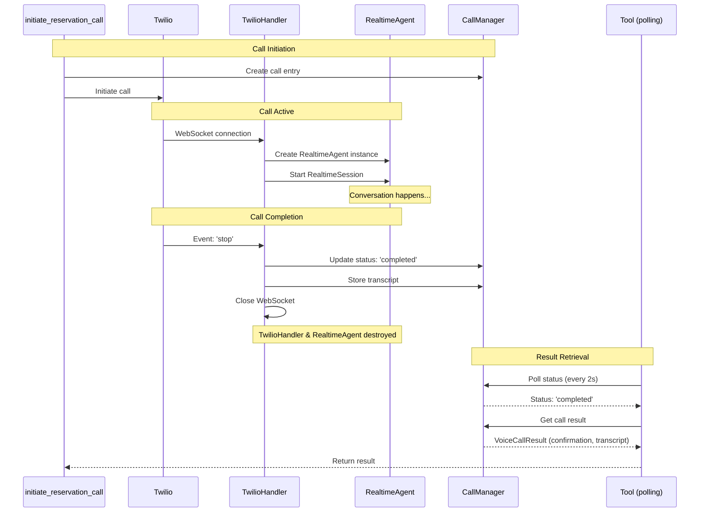
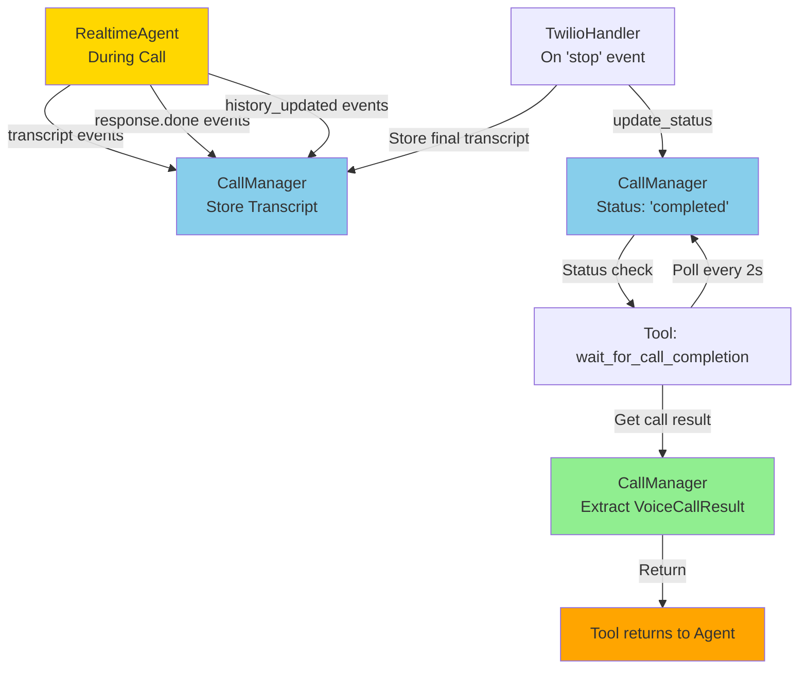
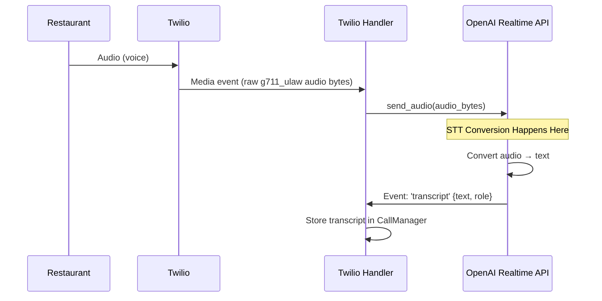
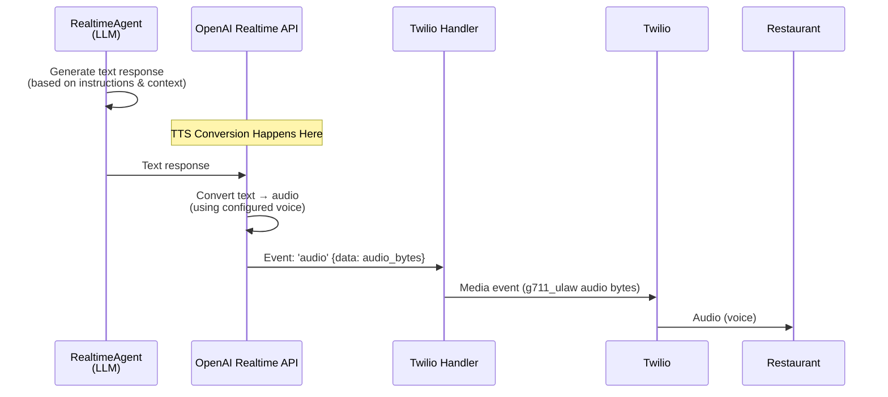
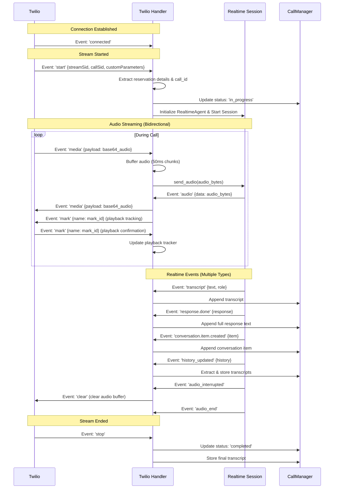
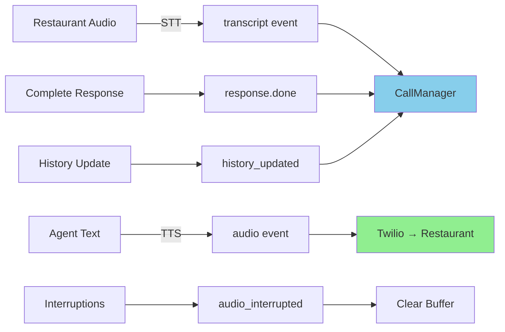

# Twilio Realtime Voice Call Flow

This document visualizes the complete flow of making a real-time voice call for restaurant reservations using Twilio Media Streams and OpenAI Realtime API.

## Complete Call Flow



## Voice Agent Lifecycle and Result Passing

### Agent Lifetime

The **RealtimeAgent instance is ephemeral** - it only exists during the active call:



### Key Points

1. **One Agent Per Call**: Each call gets its own `TwilioHandler` and `RealtimeAgent` instance
2. **Created on WebSocket Connect**: Agent is created when Twilio connects to `/media-stream` endpoint
3. **Destroyed on Call End**: When Twilio sends `stop` event, the WebSocket closes and both handler and agent are garbage collected
4. **Result Stored in CallManager**: The agent doesn't return results directly - everything is stored in `CallManager` which persists across the call lifecycle

### Result Passing Flow



### Detailed Flow

1. **During Call**:
   - RealtimeAgent emits events (`transcript`, `response.done`, etc.)
   - TwilioHandler stores all transcripts in CallManager
   - CallManager tracks call state: `pending` → `in_progress` → `completed`

2. **Call Completion**:
   - Twilio sends `stop` event to TwilioHandler
   - TwilioHandler updates CallManager: `status = "completed"`
   - TwilioHandler triggers transcript analysis (LLM extracts confirmation number)
   - WebSocket closes → TwilioHandler and RealtimeAgent are destroyed

3. **Result Retrieval**:
   - Tool (`initiate_reservation_call`) polls CallManager every 2 seconds
   - Waits for status to become `"completed"`
   - Waits up to 10 seconds for transcript analysis to complete
   - Extracts `VoiceCallResult` from CallManager with:
     - Confirmation number
     - Confirmed time/date (if different from requested)
     - Full transcript
     - Call duration

4. **Result Return**:
   - Tool returns dictionary to ReservationAgent
   - ReservationAgent formats and returns to Orchestrator
   - Orchestrator returns to user

### Why This Architecture?

- **Separation of Concerns**: Agent handles conversation, CallManager handles state
- **Async Communication**: Tool doesn't block waiting for call - it polls
- **Persistence**: CallManager persists results even if agent is destroyed
- **Scalability**: Multiple calls can run concurrently, each with its own agent instance

## Speech-to-Text and Text-to-Speech

**All STT (Speech-to-Text) and TTS (Text-to-Speech) conversion happens inside the OpenAI Realtime API service.**

### Speech-to-Text (STT) Flow



**Key Points:**
- Restaurant audio arrives as raw g711_ulaw bytes from Twilio
- TwilioHandler passes audio directly to OpenAI Realtime API (no conversion)
- **OpenAI Realtime API performs STT internally** and emits `transcript` events
- The handler receives text transcripts, not audio

### Text-to-Speech (TTS) Flow



**Key Points:**
- RealtimeAgent generates text responses (like a regular LLM)
- **OpenAI Realtime API performs TTS internally** using the configured voice (e.g., "alloy")
- The handler receives audio bytes ready to send to Twilio
- No TTS conversion happens in the TwilioHandler

### Summary

- **TwilioHandler**: Only handles audio pass-through (raw bytes) and event routing
- **OpenAI Realtime API**: Handles ALL conversion:
  - **STT**: Restaurant audio → Text transcripts
  - **TTS**: Agent text responses → Audio output
- **RealtimeAgent**: Works with text internally (like a regular LLM), but the Realtime API wraps it with voice capabilities

## Audio Streaming Details

### Audio Format Configuration

The system is configured to use **g711_ulaw** format to match Twilio's native format:

- **Twilio**: Uses g711_ulaw at 8kHz (native format, no conversion)
- **OpenAI Realtime API**: Configured with `input_audio_format: "g711_ulaw"` and `output_audio_format: "g711_ulaw"`
- **Benefit**: No audio format conversion needed, reducing latency and complexity
- **Audio Buffering**: 50ms chunks (400 bytes at 8kHz) for optimal real-time performance

**Note**: The audio format is explicitly configured in `RealtimeRunner.model_config` to match Twilio's format. This ensures compatibility and optimal performance.

### WebSocket Events



## Realtime Event Usage During Calls

Each Realtime event serves a specific purpose during the voice call:

### 1. `audio` Event
**Purpose**: Deliver agent's voice output to the restaurant

**What happens**:
- Realtime API converts agent's text response to audio (TTS)
- Sends audio bytes to TwilioHandler
- Handler forwards audio to Twilio via WebSocket
- Handler also sends a `mark` event for playback tracking

**Used for**: Real-time voice output to restaurant

### 2. `transcript` Event
**Purpose**: Capture real-time speech-to-text conversion

**What happens**:
- Realtime API converts restaurant audio to text (STT)
- Emits transcript with role (`user` or `assistant`) and text
- Handler stores transcript in CallManager for later analysis

**Used for**: 
- Real-time conversation logging
- Extracting confirmation numbers (via Transcript Analysis Agent)
- Call history and debugging

### 3. `audio_interrupted` Event
**Purpose**: Handle interruptions gracefully

**What happens**:
- Triggered when restaurant interrupts the agent mid-speech
- Handler sends `clear` event to Twilio to clear audio buffer
- Prevents audio overlap and confusion

**Used for**: Managing turn-taking and interruptions

### 4. `response.done` Event
**Purpose**: Capture complete agent responses

**What happens**:
- Emitted when agent finishes a complete response
- Contains full text of the response (not just audio)
- Handler stores in CallManager for comprehensive transcript

**Used for**: 
- Complete conversation history
- Better transcript quality (full responses, not just partial transcripts)

### 5. `conversation.item.created` Event
**Purpose**: Track conversation items as they're created

**What happens**:
- Emitted when new conversation items are added to history
- Contains role and text content
- Handler stores in CallManager

**Used for**: 
- Comprehensive conversation tracking
- Multiple transcript capture methods (redundancy for reliability)

### 6. `history_updated` Event
**Purpose**: Extract transcripts from conversation history

**What happens**:
- Emitted when conversation history is updated
- Contains full history with transcripts and text
- Handler extracts all transcripts and stores in CallManager

**Used for**: 
- Comprehensive transcript capture
- Fallback method to ensure nothing is missed
- Post-call analysis

### 7. `audio_end` Event
**Purpose**: Signal end of audio stream

**What happens**:
- Emitted when audio stream ends
- Currently only logged for debugging

**Used for**: Debugging and monitoring audio stream lifecycle

### Event Flow Summary



**Key Insight**: Multiple event types (`transcript`, `response.done`, `conversation.item.created`, `history_updated`) all contribute to building a complete transcript. 

## Component Responsibilities

### 1. TwilioService
- **Location**: `concierge/services/twilio_service.py`
- **Purpose**: Initiate outbound calls via Twilio REST API
- **Key Methods**:
  - `initiate_call(to_number, twiml_url, status_callback)`: Start call
  - `_validate_phone_number()`: Security check (only demo number allowed)

### 2. TwilioHandler
- **Location**: `concierge/twilio_handler.py`
- **Purpose**: Manage WebSocket connection and audio streaming
- **Key Responsibilities**:
  - Accept WebSocket connection from Twilio
  - Extract reservation details from 'start' event
  - Create and manage RealtimeAgent instance
  - Handle bidirectional audio streaming (Twilio ↔ OpenAI)
  - Track playback for audio synchronization
  - Store transcripts in CallManager

### 3. RealtimeAgent (OpenAI)
- **Location**: `concierge/agents/voice_agent.py` (ReservationVoiceAgent)
- **Purpose**: Conduct natural voice conversation
- **Key Features**:
  - Dynamic instructions with reservation details
  - Voice Activity Detection (VAD) for turn-taking
  - Real-time audio processing
  - Transcript generation
  - Handles interruptions gracefully

### 4. CallManager
- **Location**: `concierge/services/call_manager.py`
- **Purpose**: Track call state and results
- **Key Responsibilities**:
  - Create call entries with unique IDs
  - Store reservation details
  - Track call status (pending, in_progress, completed, error)
  - Append transcript lines
  - Extract confirmation numbers from transcripts
  - Provide call results for polling

### 5. FastAPI Server
- **Location**: `concierge/api.py` (or `concierge/server.py`)
- **Purpose**: HTTP endpoints and WebSocket handler
- **Key Endpoints**:
  - `GET /twiml?call_id={id}`: Generate TwiML instructions
  - `WebSocket /media-stream`: Handle Twilio Media Stream
  - `POST /twilio-status`: Receive call status callbacks
  - `GET /calls/{call_id}/status`: Check call status (for polling)

## TwiML Example

When Twilio fetches instructions from `/twiml`, the server responds with:

```xml
<?xml version="1.0" encoding="UTF-8"?>
<Response>
    <Connect>
        <Stream url="wss://your-domain.ngrok.io/media-stream">
            <Parameter name="call_id" value="abc-123"/>
            <Parameter name="restaurant_name" value="Luigi's"/>
            <Parameter name="party_size" value="4"/>
            <Parameter name="date" value="tomorrow"/>
            <Parameter name="time" value="7pm"/>
            <Parameter name="customer_name" value="John"/>
        </Stream>
    </Connect>
</Response>
```

This instructs Twilio to:
1. Connect audio stream to WebSocket endpoint
2. Pass reservation details as custom parameters


## Deployment Requirements

1. **Twilio Account**:
   - Account SID and Auth Token
   - Phone number with Media Streams capability
   - Webhook URLs must be publicly accessible

2. **Public Domain** (for local development):
   - Use ngrok: `ngrok http 8080`
   - Set `PUBLIC_DOMAIN=abc123.ngrok.io` in `.env`
   - Twilio needs to reach your server for webhooks

3. **OpenAI API**:
   - API key with Realtime API access
   - Model: `gpt-4o-realtime-preview-2024-10-01`

4. **Server Requirements**:
   - FastAPI server running on accessible port
   - WebSocket support enabled
   - Low-latency network connection for real-time audio

## Security Considerations

1. **Phone Number Validation**: Only the demo restaurant number can be called
2. **Rate Limiting**: Guardrails prevent abuse (5/hour, 20/day)
3. **Session Isolation**: Each call has unique ID and isolated state
4. **Transcript Privacy**: Transcripts stored only in memory (not persisted)
5. **API Key Protection**: Never exposed in logs or responses