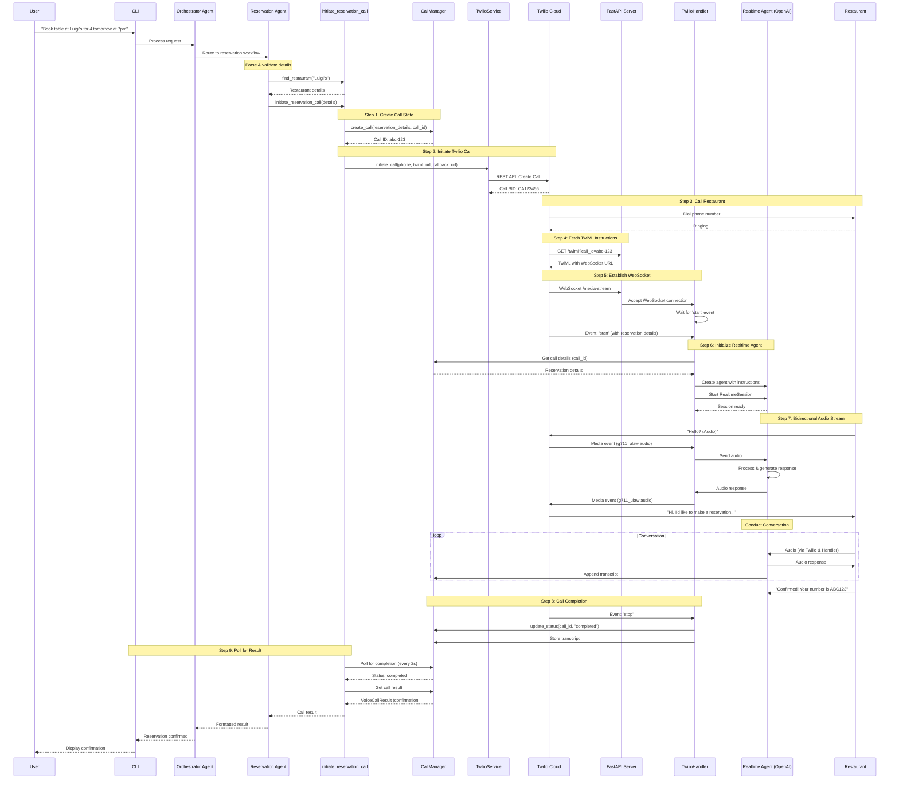
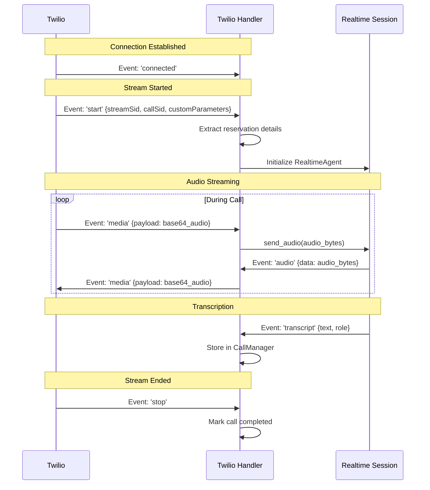
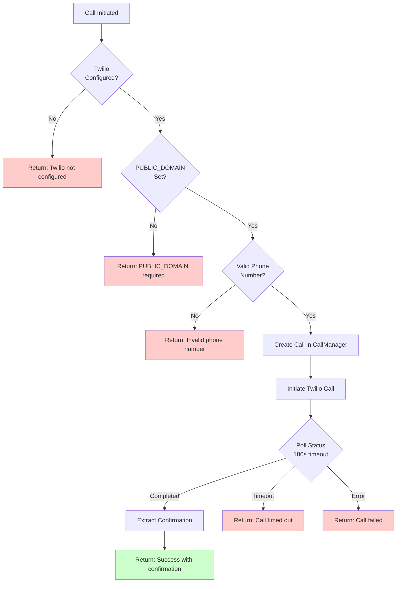

# Twilio Realtime Voice Call Flow

This document visualizes the complete flow of making a real-time voice call for restaurant reservations using Twilio Media Streams and OpenAI Realtime API.

## Complete Call Flow



## Audio Streaming Details

### Audio Format Handling

```mermaid
graph LR
    Restaurant[Restaurant<br/>Audio Input] -->|Analog| TwilioCloud[Twilio Cloud]
    TwilioCloud -->|g711_ulaw<br/>8kHz| WebSocket[WebSocket<br/>Media Stream]
    WebSocket --> TwilioHandler[Twilio Handler]
    TwilioHandler -->|g711_ulaw<br/>8kHz| RealtimeAPI[OpenAI<br/>Realtime API]
    
    RealtimeAPI -->|g711_ulaw<br/>8kHz| TwilioHandler2[Twilio Handler]
    TwilioHandler2 -->|g711_ulaw<br/>8kHz| WebSocket2[WebSocket<br/>Media Stream]
    WebSocket2 -->|g711_ulaw<br/>8kHz| TwilioCloud2[Twilio Cloud]
    TwilioCloud2 -->|Analog| Restaurant2[Restaurant<br/>Audio Output]
    
    style TwilioHandler fill:#87ceeb
    style TwilioHandler2 fill:#87ceeb
    style RealtimeAPI fill:#90ee90
```



**Key Points:**
- Twilio uses **g711_ulaw** audio format at **8kHz** sample rate
- OpenAI Realtime API configured to use **g711_ulaw** (no conversion needed)
- Bidirectional streaming: Full-duplex communication
- Audio buffered in 50ms chunks for optimal performance

### WebSocket Events



## Component Responsibilities

### 1. TwilioService
- **Location**: `concierge/services/twilio_service.py`
- **Purpose**: Initiate outbound calls via Twilio REST API
- **Key Methods**:
  - `initiate_call(to_number, twiml_url, status_callback)`: Start call
  - `_validate_phone_number()`: Security check (only demo number allowed)

### 2. TwilioHandler
- **Location**: `concierge/twilio_handler.py`
- **Purpose**: Manage WebSocket connection and audio streaming
- **Key Responsibilities**:
  - Accept WebSocket connection from Twilio
  - Extract reservation details from 'start' event
  - Create and manage RealtimeAgent instance
  - Handle bidirectional audio streaming (Twilio ↔ OpenAI)
  - Track playback for audio synchronization
  - Store transcripts in CallManager

### 3. RealtimeAgent (OpenAI)
- **Location**: `concierge/agents/voice_agent.py` (ReservationVoiceAgent)
- **Purpose**: Conduct natural voice conversation
- **Key Features**:
  - Dynamic instructions with reservation details
  - Voice Activity Detection (VAD) for turn-taking
  - Real-time audio processing
  - Transcript generation
  - Handles interruptions gracefully

### 4. CallManager
- **Location**: `concierge/services/call_manager.py`
- **Purpose**: Track call state and results
- **Key Responsibilities**:
  - Create call entries with unique IDs
  - Store reservation details
  - Track call status (pending, in_progress, completed, error)
  - Append transcript lines
  - Extract confirmation numbers from transcripts
  - Provide call results for polling

### 5. FastAPI Server
- **Location**: `concierge/api.py` (or `concierge/server.py`)
- **Purpose**: HTTP endpoints and WebSocket handler
- **Key Endpoints**:
  - `GET /twiml?call_id={id}`: Generate TwiML instructions
  - `WebSocket /media-stream`: Handle Twilio Media Stream
  - `POST /twilio-status`: Receive call status callbacks
  - `GET /calls/{call_id}/status`: Check call status (for polling)

## TwiML Example

When Twilio fetches instructions from `/twiml`, the server responds with:

```xml
<?xml version="1.0" encoding="UTF-8"?>
<Response>
    <Connect>
        <Stream url="wss://your-domain.ngrok.io/media-stream">
            <Parameter name="call_id" value="abc-123"/>
            <Parameter name="restaurant_name" value="Luigi's"/>
            <Parameter name="party_size" value="4"/>
            <Parameter name="date" value="tomorrow"/>
            <Parameter name="time" value="7pm"/>
            <Parameter name="customer_name" value="John"/>
        </Stream>
    </Connect>
</Response>
```

This instructs Twilio to:
1. Connect audio stream to WebSocket endpoint
2. Pass reservation details as custom parameters

## Realtime Agent Configuration

```python
RealtimeRunner(agent).run(
    model_config={
        "api_key": openai_api_key,
        "initial_model_settings": {
            "input_audio_format": "g711_ulaw",  # Match Twilio
            "output_audio_format": "g711_ulaw", # Match Twilio
            "voice": "alloy",                   # Voice selection
            "turn_detection": {
                "type": "server_vad",           # Server-side VAD
                "threshold": 0.5,
                "prefix_padding_ms": 300,
                "silence_duration_ms": 500,
            },
        },
        "playback_tracker": playback_tracker,   # Audio sync
    }
)
```

## Error Handling



## Deployment Requirements

1. **Twilio Account**:
   - Account SID and Auth Token
   - Phone number with Media Streams capability
   - Webhook URLs must be publicly accessible

2. **Public Domain** (for local development):
   - Use ngrok: `ngrok http 8080`
   - Set `PUBLIC_DOMAIN=abc123.ngrok.io` in `.env`
   - Twilio needs to reach your server for webhooks

3. **OpenAI API**:
   - API key with Realtime API access
   - Model: `gpt-4o-realtime-preview-2024-10-01`

4. **Server Requirements**:
   - FastAPI server running on accessible port
   - WebSocket support enabled
   - Low-latency network connection for real-time audio

## Security Considerations

1. **Phone Number Validation**: Only the demo restaurant number can be called
2. **Rate Limiting**: Guardrails prevent abuse (5/hour, 20/day)
3. **Session Isolation**: Each call has unique ID and isolated state
4. **Transcript Privacy**: Transcripts stored only in memory (not persisted)
5. **API Key Protection**: Never exposed in logs or responses

## Monitoring and Debugging

### Key Metrics to Track
- Call initiation time
- WebSocket connection latency
- Audio streaming quality
- Call duration
- Success/failure rates

### Logging Points
1. `TwilioService.initiate_call()`: Call initiated
2. `TwilioHandler.start()`: WebSocket connected
3. `TwilioHandler._handle_realtime_event()`: Transcripts
4. `CallManager.update_status()`: Status changes
5. `wait_for_call_completion()`: Polling progress

See the [OpenAI Agents SDK Tracing](https://openai.github.io/openai-agents-python/tracing/) for additional monitoring capabilities.

